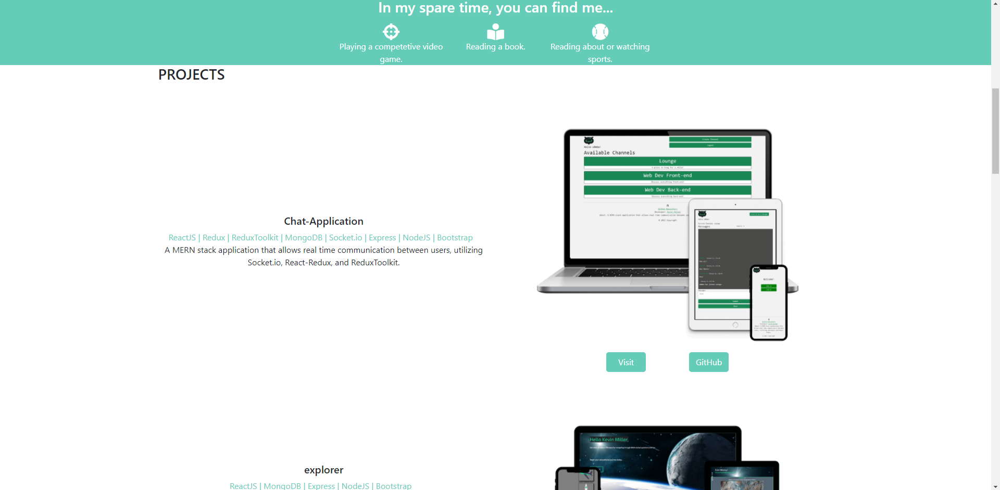

# Portfolio Redux

## Description

A MERN stack application, utilizing React-Redux, to act as a portfolio for my projects and resume.

## Table of Contents

- [Installation](#installation)
- [Usage](#usage)
- [Contributing](#contributing)
- [Tests](#tests)
- [Questions](#questions)

## Installation

_Steps required to install package:_

N/A

## Usage

_Examples of project use:_

## Contributing

_If you are interested in contributing to this project, please follow the below instructions:_

Pull requests not welcome at this time.

## Tests

_Application tests and instructions for them:_

N/A

## License

None

## Questions

_If you have any questions regarding this application, please utilize the below contact information:_

[kmiller343@gmail.com](mailto:kmiller343@gmail.com)

[GitHub Profile](https://www.github.com/k1te-m)
